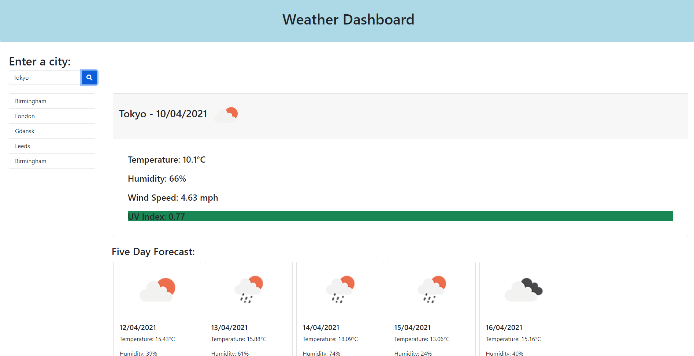

# Weather Dashboard

## Description

For this project I used Bootstrap to style the main page, and I used jQuery for my main.js file.

I had to connect to OpenWeatherMap's API's, I used the Current Weather API and the OneCall API. The Current Weather API would return the temperature, humidity, wind speed, and date for the current day, and the OneCall API had to be used for the UV index and the five day forecast. Weather icon's are rendered with both of these.

The current weather is rendered inside of a card when you search for a city, whilst all cards are dynamically constructed for the five day forecast.

I have also used local storage to store recently searched cities.

## Screenshots

Weather Page:

## Project Github Pages Link

[Deployed GitHub Pages Site](https://leon3005.github.io/Weather_Dashboard/)

## Contact

Please report any bugs to [my email](mailto:leonwheeler08@gmail.com) 😀
